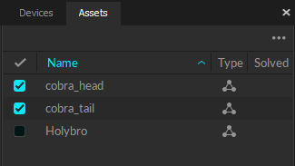
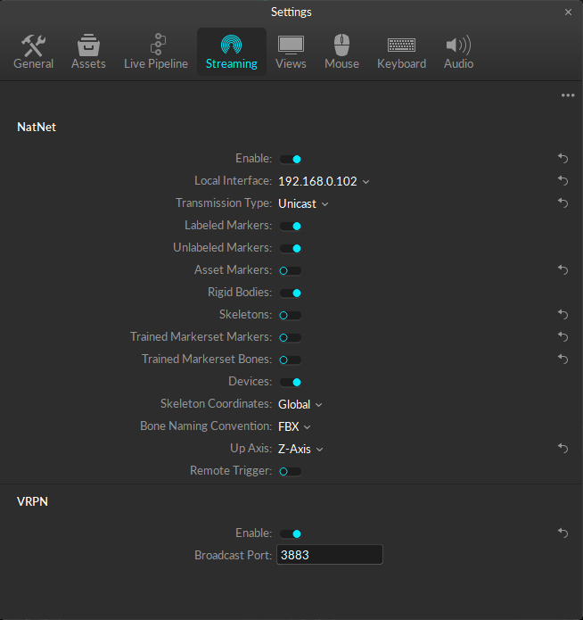

# [Offical Motive Documentation](https://docs.optitrack.com/motive)

## [Motive UI Panes](https://docs.optitrack.com/motive-ui-panes)

For further details, refer to the official Motive documentation. Links to the corresponding sections are cited throughout.


# Calibrating OptiTrack

### [Starting a New Calibration](https://docs.optitrack.com/motive/calibration#starting-a-new-calibration)

1. Launch Motive and turn on the cameras

**NOTE:** If Motive crashes when the cameras are turned on, delete the following files and reopen the application<sup>1</sup>

`C:\ProgramData\OptiTrack\MotiveProfile.motive`
`C:\ProgramData\Optitrack\Motive\System Calibration.cal`

2. Remove all markers from arena (if possible) and click `New Calibration` ⟶ `Mask` ⟶ `Continue` [[Masking](https://docs.optitrack.com/motive/calibration#masking)]

3. Grab the calibration wand from the wall and click `Start Wanding` [[Wanding Steps](https://docs.optitrack.com/motive/calibration#wanding-steps)]

    *Bring your calibration wand into the capture volume and wave the wand gently across the entire volume. Slowly draw figure-eights repetitively with the wand to collect samples at varying orientations while covering as much space as possible for sufficient sampling.*

    Note the [LED Indicator Ring](https://docs.optitrack.com/motive/calibration#primex-series-led-indicator-ring) for feedback while wanding

4. When wanding is complete, **return the calibration wand to the wall** and click `Start Calculating` ⟶ `Continue` (~0.5mm Mean Ray Error is sufficient)

5. Grab the calibration square from the wall and place it in the desired pose on the floor of the arena and click `Set Ground Plane` [[Ground Plane and Origin](https://docs.optitrack.com/motive/calibration#ground-plane-and-origin)]

    This will be the origin of the world frame

6. **Return the calibration square to the wall**, calibration is complete

1 Currently, my best guess is the crashing has something to do with VRPN being enabled when there are no rigid bodies in the arena, or maybe when there are stray markers in the arena. Deleting the `.motive` file should reset the streaming settings back to default, which disables VRPN and allows the program to boot successfully. I have had the most success fixing this issue by messing around with the rigid bodies/markers in the arena.


# Creating Rigid Bodies

### [Rigid Body Tracking](https://docs.optitrack.com/motive/rigid-body-tracking)

1. Place the marked object in the arena [[Rigid Body Marker Placement](https://docs.optitrack.com/motive/rigid-body-tracking#rigid-body-marker-placement)]

2. Select the entire set of markers and right-click ⟶ `Create Rigid Body` [[Creating a Rigid Body](https://docs.optitrack.com/motive/rigid-body-tracking#creating-a-rigid-body)]

<div align='center'>

</div>

3. Name the rigid body a with unique string (ideally **without spaces**)

<div align='center'>

</div>

See [Adjusting a Rigid Body Pivot Point](https://docs.optitrack.com/motive/rigid-body-tracking#adjusting-a-rigid-body-pivot-point) to modify the frame for an object

# Changing the Ground Plane

### [Change Ground Plane](https://docs.optitrack.com/motive-ui-panes/calibration-pane#change-ground-plane)

The ground plane can be changed at any time without recalibrating the system. This can be useful to move to origin of the world frame to a desired pose.

1. Select `Change Ground Plane...` in the [Calibration Pane](https://docs.optitrack.com/motive-ui-panes/calibration-pane)

2. Grab the calibration square from the wall and place it in the desired pose on the floor of the arena and click `Set Ground Plane` [[Ground Plane and Origin](https://docs.optitrack.com/motive/calibration#ground-plane-and-origin)]

    This will be the origin of the world frame

3. **Return the calibration square to the wall**, the process is complete


# Streaming with VRPN

### [Streaming Settings](https://docs.optitrack.com/motive/data-streaming#streaming-settings)

**Follow the steps in exact order**

1. Calibrate and create rigid bodies with any markers in the arena

1. Open the Streaming settings, enable NatNet and make the following changes,
    - set `Local Interface` to **192.168.0.xxx** (NOT loopback, this IP should match the `server` ROS parameter)
    - set `Transmission Type` to **Unicast**
    - set `Up Axis` to **Z-Axis** to match ROS
2. Enable VRPN

<div align='center'>

</div>

4. On your ROS2 machine, modify [client.yaml](../config/client.yaml) with the desired settings and launch with,

    ```
    ros2 launch vrpn_mocap client.launch.py server:=<server ip> port:=<port>
    ```

    **The default args for server and port are already configured for the drone cage**

3. If everything is working correctly, on launch you should see,

    ```
    [vrpn_mocap.vrpn_mocap_client_node]: Created new tracker <rigid_body_name>
    ```

    along with the corresponding topics published for each rigid body,

    ```
    /vrpn_mocap/<rigid_body_name>/pose
    ```

4. **IMPORTANT:** Before shutting down, return the Streaming settings to the defaults to prevent future crashes, namely,

    - Disable VRPN
    - set `Local Interface` to loopback